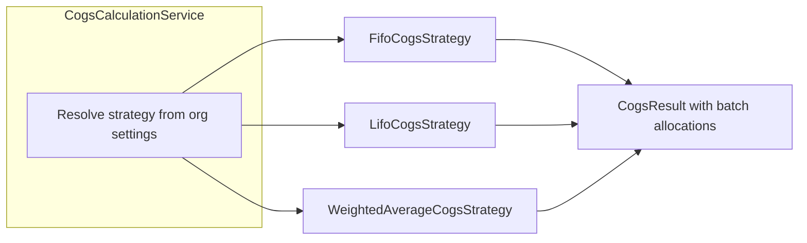

# Inventory Module — Entity Relationship Diagram

Inventory, batch tracking, and COGS valuation from Flyway migration `V5__inventory.sql`.

## Diagram

```mermaid
erDiagram
    organizations ||--|| organization_settings : "configures"
    organizations ||--o{ stock_batches : "owns"
    warehouses ||--o{ stock_batches : "stores"
    products ||--o{ stock_batches : "stocked"
    organizations ||--o{ inventory_movements : "records"
    inventory_movements ||--o{ batch_allocations : "allocates"
    stock_batches ||--o{ batch_allocations : "consumed_from"

    organization_settings {
        uuid id PK
        uuid organization_id FK UK
        varchar valuation_method "FIFO|LIFO|WEIGHTED_AVERAGE"
        boolean allow_negative_stock
        boolean low_stock_alert_enabled
        int expiry_alert_days
    }

    stock_batches {
        uuid id PK
        uuid warehouse_id FK
        uuid product_id FK
        varchar batch_number UK "per warehouse+product+variant"
        numeric quantity
        numeric remaining_quantity
        numeric unit_cost
        date expiry_date
    }

    inventory_movements {
        uuid id PK
        uuid warehouse_id FK
        uuid product_id FK
        varchar movement_type "IN|OUT|ADJUSTMENT|TRANSFER_IN|TRANSFER_OUT"
        numeric quantity "signed"
        numeric total_cost
        varchar reference_type
        uuid reference_id
    }

    batch_allocations {
        uuid id PK
        uuid movement_id FK
        uuid batch_id FK
        numeric quantity
        numeric unit_cost
        numeric total_cost
    }
```

## COGS Strategy Pattern



| Method | Allocation order | Cost basis |
|--------|------------------|------------|
| FIFO (default) | Oldest `received_at` first | Batch unit cost |
| LIFO | Newest `received_at` first | Batch unit cost |
| Weighted average | FIFO physical depletion | Blended average unit cost |

## Business Rules

- Default valuation method is **FIFO** (`organization_settings.valuation_method`).
- Negative stock is blocked unless `allow_negative_stock = true`.
- Low-stock alerts compare batch totals to product `reorder_level`.
- Expiry alerts list batches with `expiry_date` within configured horizon.
- Every outbound movement persists `batch_allocations` for audit and COGS.

## Cross-Module Links

| Source | Creates |
|--------|---------|
| Manual stock-in | `stock_batches` + `IN` movement |
| Transfer ship | `TRANSFER_OUT` movement |
| Transfer receive | New batch + `TRANSFER_IN` movement |
| Stock count variance | `ADJUSTMENT` movement |
| Inventory adjustment | `ADJUSTMENT` movement |
