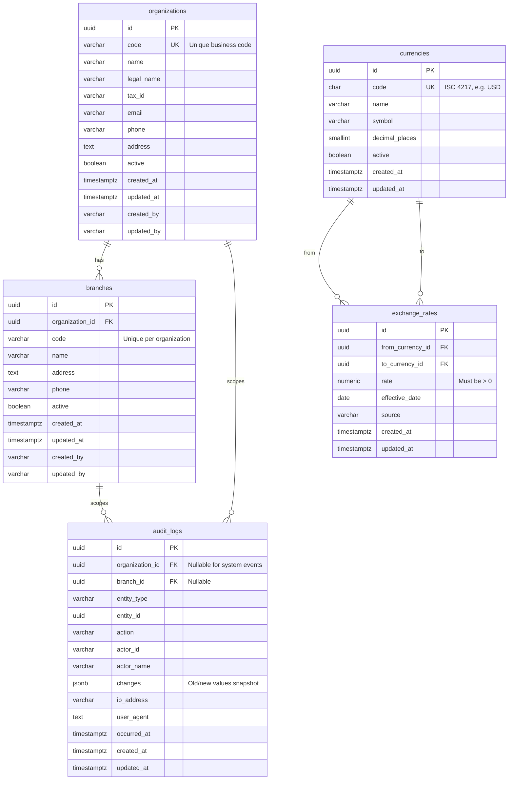

# Platform Module — Entity Relationship Diagram

The platform module provides multi-tenant foundations shared by all ERP modules: organization and branch hierarchy, audit logging, and multi-currency support.

This ERD reflects the Flyway migration `V1__platform.sql` in `platform-service`.

## Diagram

## Entity Descriptions

### Organization

The top-level tenant. Every supermarket business using the ERP is represented by one organization. Organization codes are globally unique and used for identification in integrations and reporting.

### Branch

A physical or logical location belonging to an organization (store, warehouse office, HQ). Branch codes are unique within their parent organization. Branch-scoped modules (sales, inventory, expenses) reference `branch_id`.

### Audit Log

Immutable record of business actions. Captures who performed an action, on which entity, what changed (JSON snapshot), and request metadata (IP, user agent). Not tied to JPA `@Entity` audit fields — written explicitly by application services on mutating operations.

### Currency

Master list of supported currencies (ISO 4217 three-letter codes). Shared across all organizations. Inactive currencies cannot be used in new transactions but remain for historical records.

### Exchange Rate

Daily (or effective-dated) conversion rate between two distinct currencies. The unique constraint on `(from_currency_id, to_currency_id, effective_date)` prevents duplicate rates for the same pair on the same day.

## Cross-Module Relationships (Future Phases)

The following relationships are defined in later migrations and are shown here for context:

| Future entity | Platform link |
|---------------|---------------|
| User | `organization_id`, optional default `branch_id` |
| Warehouse | `branch_id` |
| Sales / Purchase documents | `organization_id`, `branch_id` |
| Organization settings | `organization.base_currency_id` → `currencies` |

## Indexing Strategy

| Table | Index | Purpose |
|-------|-------|---------|
| `branches` | `organization_id` | List branches by org |
| `audit_logs` | `organization_id` | Tenant-scoped audit queries |
| `audit_logs` | `(entity_type, entity_id)` | Entity history |
| `audit_logs` | `occurred_at DESC` | Recent activity feed |
| `exchange_rates` | `effective_date DESC` | Latest rate lookup |

## Naming Conventions

- Primary keys: UUID (`gen_random_uuid()`)
- Timestamps: `TIMESTAMPTZ` stored in UTC
- Soft lifecycle: `active` boolean (no hard deletes on master data)
- Audit columns on master entities: `created_at`, `updated_at`, `created_by`, `updated_by`
