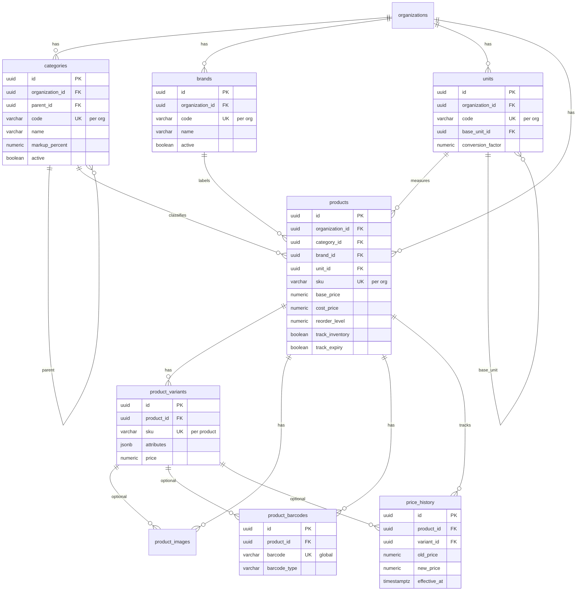

# Products Module — Entity Relationship Diagram

Product catalog schema from Flyway migrations `V3__products.sql`. All entities are scoped to an organization.

## Diagram

## Key Relationships

| Entity | Platform link |
|--------|---------------|
| Category, Brand, Unit, Product | `organization_id` → `organizations` |
| Product | Optional `category_id`, `brand_id`; required `unit_id` |
| Product variant | `product_id` → `products` (cascade delete) |
| Barcode | Globally unique `barcode`; linked to product and optional variant |

## Business Rules

- SKU is unique per organization; variant SKU is unique per product.
- Barcode is globally unique across all organizations.
- Price changes on products or variants create immutable `price_history` rows.
- Category `markup_percent` drives dynamic pricing when no override is supplied.

## Cross-Module Links

| Consumer module | Reference |
|-----------------|-----------|
| Warehouse transfers | `product_id`, `variant_id` on transfer lines |
| Inventory / batches | `product_id`, `variant_id` on stock batches and movements |
