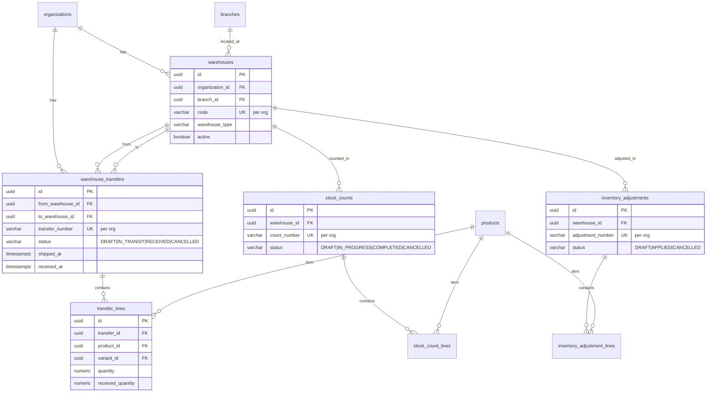
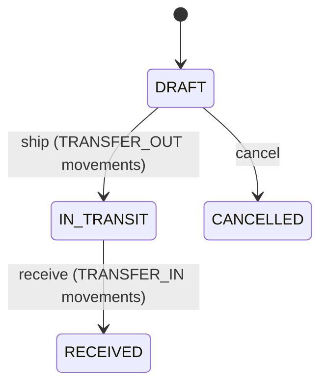

# Warehouse Module — Entity Relationship Diagram

Warehouse operations schema from Flyway migration `V4__warehouse.sql`.

## Diagram

## Transfer Lifecycle

## Business Rules

- Source and destination warehouses must differ.
- Shipping creates outbound inventory movements at the source warehouse.
- Receiving creates inbound batches at the destination warehouse.
- Stock count completion posts adjustment movements for non-zero variances.
- Applied adjustments create signed inventory movements per line.
